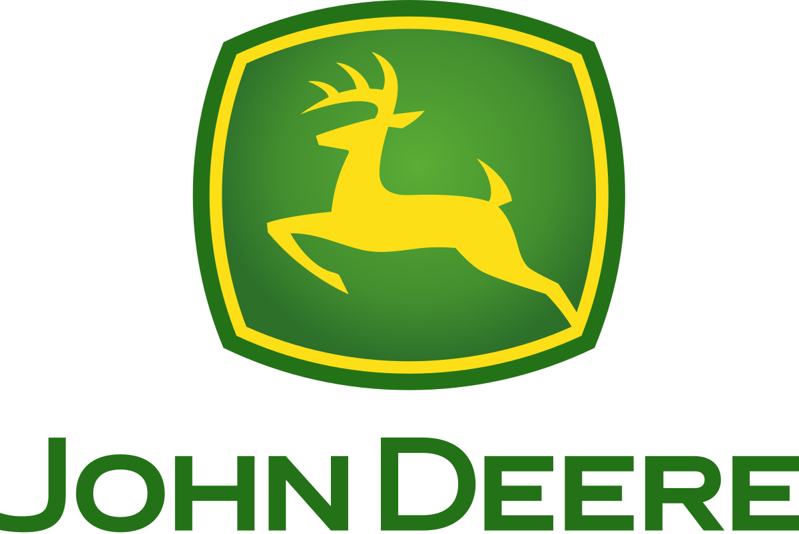

import '../styles/sponsors.css';

# Sponsors

We thank our sponsors for supporting SIGPwny!

## Fall CTF Sponsors

    
    

## UIUCTF Sponsors

    
    

## How to become a sponsor

If you are interested in becoming a sponsor, please contact us at [sponsors@sigpwny.com](mailto:sponsors@sigpwny.com). Sponsors receive a variety of benefits,
from resume books, to brand exposure and positions at recruiting events. We are happy to work with you!